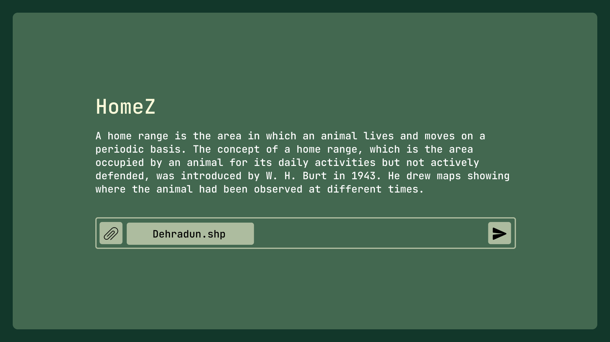

<div align="center">
  <p>
    <a href="https://github.com/Vijay-J0shi/HomeZ" target="_blank">
      </a>
  </p>

<br/>


[HomeZ WEBSITE](https://github.com/Vijay-J0shi/HomeZ)
  <p>
    <a href="https://github.com/Vijay-J0shi/HomeZ" target="_blank">
      </a>
  </p>


</div>

# File Selector and Data Processing Tool

## Overview

This is a desktop application built using Python and PyQt5 that allows users to select CSV files, choose a data processing algorithm (Minimum Convex Polygon (MCP) or Kernel Density Estimation (KDE)), and visualize the results through image rendering. It is designed with a sleek, modern user interface that features data visualization, file selection, and result downloading functionalities.

## Features

1. **File Selection**: Allows users to select a CSV file for processing.
2. **Algorithm Selection**: Offers two algorithms for data processing:
   - MCP (Minimum Convex Polygon)
   - KDE (Kernel Density Estimation)
3. **Data Visualization**: Displays the processed images for day and night data.
4. **Error Handling**: Validates inputs and provides feedback for invalid selections.
5. **Download Functionality**: Allows users to save the processed images and data to their local machine.
6. **Back Navigation**: Option to go back to the file selection window.
7. **Resizable Layout**: Adapts to different screen sizes for improved user experience.

## Prerequisites

Ensure you have the following installed on your system:

1. **Python 3.x**: The latest version of Python 3.
2. **PyQt5**: To install PyQt5, use the following command:
   ```bash
   pip install pyqt5
   ```
3. **Pandas**: A popular library for data manipulation in Python:
   ```bash
   pip install pandas
   ```
4. **Other required dependencies**:
   - `img_ploter` and `minimum_convex_polygon`: Custom modules for generating images and handling MCP and KDE computations.

## Getting Started

### 1. Clone the Repository

Clone this repository to your local machine.

```bash
git clone https://github.com/your-username/your-repository.git
cd your-repository
```

### 2. Install Dependencies

Install the required Python libraries using `pip`.

```bash
pip install -r requirements.txt
```

### 3. Running the Application

To run the application, use the following command:

```bash
python app.py
```

The application will open a window where you can:

1. Select a CSV file.
2. Choose an algorithm for processing the data.
3. Visualize the results on the screen.
4. Download the generated images and data.

### 4. File Selection

- Click on the **Select File** button to open the file dialog and select your CSV file.
- After selecting the file, the **Process** button will be enabled.

### 5. Algorithm Selection

- From the drop-down menu, choose either **MCP** or **KDE**.
- For **KDE**, input a float value between 0 and 1 for bandwidth.
- For **MCP**, input a confidence interval between 7 and 100.

### 6. Viewing and Downloading Results

- After processing, the results will be displayed in the two image frames.
- You can download the images by clicking the **Download** button, which saves them in `.tiff` format along with an Excel file containing additional data.

### 7. Error Handling

If there are any issues (e.g., invalid input format, wrong file type), an error message will be displayed, and further actions will be disabled until the issue is resolved.

## Project Structure

```bash
.
├── app.py                        # Main entry point for the application
├── img_ploter.py                 # Contains functions for Kernel Density Estimation (KDE)
├── minimum_convex_polygon.py      # Contains functions for Minimum Convex Polygon (MCP) computation
├── requirements.txt              # List of dependencies
├── nature.jpg                    # Background image used in the application
├── README.md                     # This README file
└── assets/                       # Folder for assets (images, logos, etc.)
```

## Dependencies

- **PyQt5**: Used for the graphical interface, including file dialogs, layouts, and user interaction.
- **Pandas**: For reading and manipulating CSV files and displaying them in a table view.
- **Custom modules** (`img_ploter`, `minimum_convex_polygon`): For generating images and performing data processing tasks.

## How It Works

- **MCP Algorithm**: The MCP (Minimum Convex Polygon) algorithm computes the smallest convex polygon that can contain a given set of points. This is often used to describe the area an animal or object occupies.
- **KDE Algorithm**: Kernel Density Estimation is used to estimate the probability density function of a random variable based on input data points. It is useful for understanding the density distribution of data.

## Example

Here’s an example of how to use the app:

1. Launch the application.
2. Select a CSV file with the `Select File` button.
3. Choose either the **MCP** or **KDE** algorithm.
4. Input the necessary parameters (confidence interval for MCP, bandwidth for KDE).
5. Click **Start** to process the data.
6. The result will display two images, and you can download them along with an Excel file of additional data.

## Screenshots

*KDE*:  


*MCP*:  


## License

This project is licensed under the MIT License.

---

Feel free to customize this `README.md` file according to your project's specific details, adding additional information such as development roadmap, contribution guidelines, or troubleshooting tips.
<!-- TODO(Adam-Al-Rahman): Add the contributors sections -->

<!-- ## <div align="center">Contributors</div> -->

<!-- TODO(Adam-Al-Rahman): Add the  References | Citations sections -->

<!-- ## <div align="center">References | Citations </div> -->

## <div align="center">License</div>

HomeZ has a MIT-style license, as found in the MIT License file.

- **MIT Licence**: This [OSI-approved](https://opensource.org/licenses/) open-source license is ideal for students and enthusiasts, promoting open collabaration and knowledge sharing. See the [MIT License](https://github.com/Vijay-J0shi/HomeZ/blob/main/LICENSE) file for more details.
